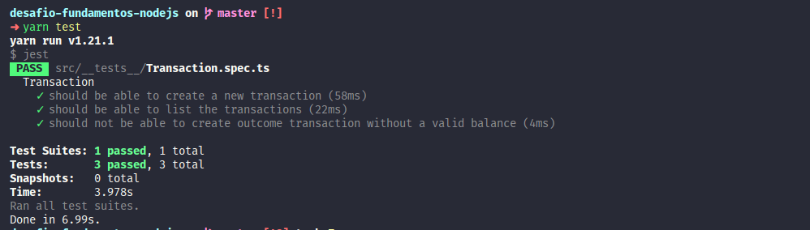

<h1 align="center">Desafio 05: Primeiro projeto Node.js -  GoStack Turma 11</h1>

### Sobre o desafio

- Desafio 05 do bootcamp da Rocketseat onde apliquei os conceitos aprendidos até agora no Node.js junto com TypeScript, utilizando os conceitos de models, repositories e services!

### Objetivo
- Criar uma aplicação para armazenar transações financeiras de entrada e saída, que permita o cadastro e a listagem dessas transações.

### Testes
- Após a implementação os testes devem ser executados para que possa ser avaliado todos os pontos do desafio proposto.

- **`should be able to create a new transaction`**: Para que esse teste passe, sua aplicação deve permitir que uma transação seja criada, e retorne um json com a transação criado.

- **`should be able to list the transactions`**: Para que esse teste passe, sua aplicação deve permitir que seja retornado um objeto contendo todas as transações junto ao balanço de income, outcome e total das transações que foram criadas até o momento.

- **`should not be able to create outcome transaction without a valid balance`**: Para que esse teste passe, sua aplicação não deve permitir que uma transação do tipo `outcome` extrapole o valor total que o usuário tem em caixa, retornando uma resposta com código HTTP 400 e uma mensagem de erro no seguinte formato: `{ error: string }`

### Resultado dos testes:

**Rocketseat!! GoStack11!! Desafio05 NodeJS!!**
